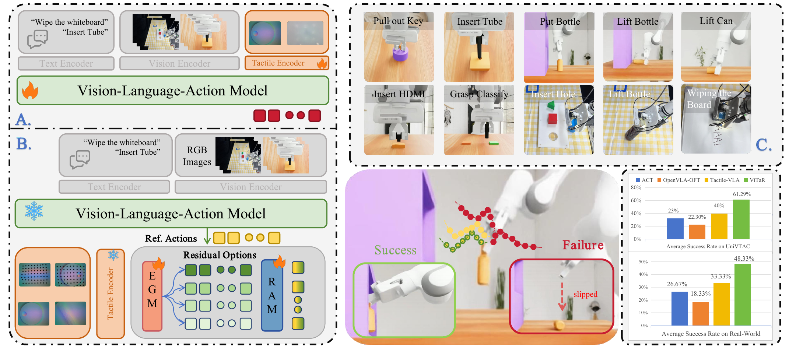

<div align="center">

# ViTaR: Visuo-Tactile Residual Adaptation for Foundation VLA Manipulation

[🌐 **Project Page**](https://icr-lab.github.io/ViTaR/) &nbsp;&nbsp;|&nbsp;&nbsp; [📄 **arXiv**](https://arxiv.org/abs/XXXX.XXXXX) &nbsp;&nbsp;|&nbsp;&nbsp; [🎥 **Video**](https://www.youtube.com/watch?v=VIDEO_ID)

<br />

<a href="assets/images/teaser.pdf">
  
</a>

<sub>Click the teaser to open the <a href="assets/images/teaser.pdf">high-resolution PDF</a>.</sub>

</div>

## Abstract

As Vision-Language-Action (VLA) models scale toward real-world deployment, contact-rich manipulation exposes a critical blind spot: these policies encode broad visual-semantic priors yet remain unaware of local contact events, producing identical actions whether contact is established, lost, or destabilized. Existing remedies either modify VLA internals, risking catastrophic forgetting, or demand online reinforcement under near-failure contact conditions. Both grant tactile unbounded influence over action generation, conflicting with the priors that make VLAs generalizable. We introduce **ViTaR**, which reframes tactile feedback from an action-generating perceptual input to an execution modulator that selects and scales bounded residual corrections atop a frozen VLA, preserving pretrained capabilities by construction. ViTaR decomposes adaptation into two stages: **Effect-Guided Modeling** determines *whether* and *which* correction is locally justified via outcome-grounded preference evidence, and **Residual Action Modulation** converts this evidence into a residual choice with continuously scaled gain from real-time visuotactile observations. On the UniVTAC benchmark spanning seven contact-rich tasks, ViTaR achieves **61.3%** average success, a **30.6 percentage-point** improvement over its frozen VLA base that also surpasses purpose-built tactile baselines. Physical-robot experiments confirm that bounded tactile modulation transfers to real sensor noise and dynamics.

---

## Website development

This repository is a dependency-free static GitHub Pages site. To preview the website locally, run the following command from this directory and open the printed local URL:

```bash
python3 -m http.server 8000
```

To publish through GitHub Pages, place the contents of this `site/` folder at the root of the GitHub repository (or configure Pages to serve this folder), then select **Settings → Pages → Deploy from a branch**.

Before release, update the remaining placeholder **arXiv** and **Video** links at the top of this README, together with the corresponding **Paper** and **Code** links in `index.html`.

The real-world videos are web-optimized H.264/AAC MP4 files with fast-start metadata and lightweight poster images, so they can begin loading promptly in GitHub Pages and common browsers.

The overview section also includes the four-minute project video at `assets/videos/vitar-overview.mp4`.
